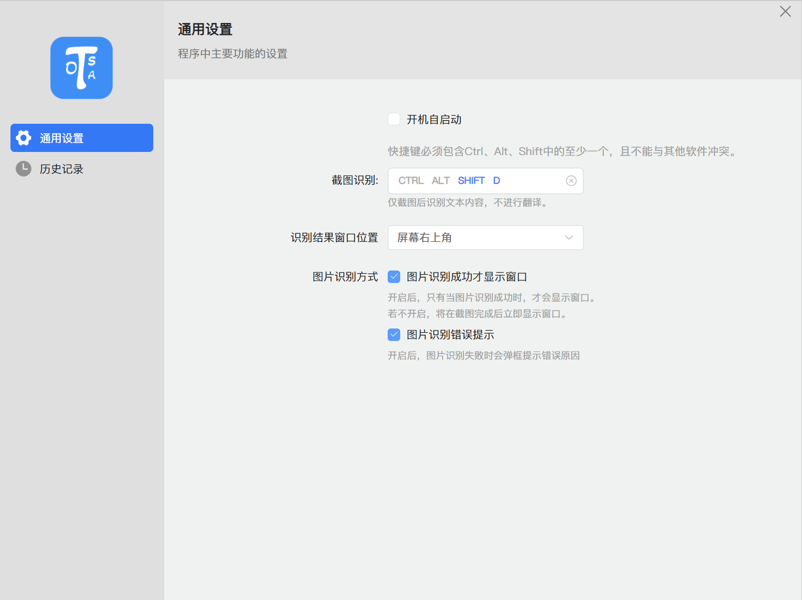
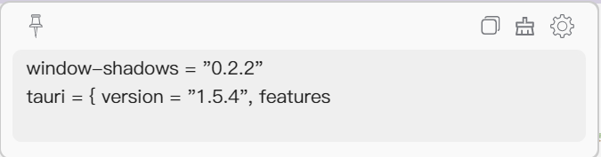

# Tosa (An application based on PaddleOCR-json)

基于PaddleOCR-json的截图OCR工具

### images





### install

```bash
pnpm i
```

### dev

```bash
pnpm run tauri dev
```

### build

```bash
pnpm run tauri build
```

### Thanks

* [tosa](https://github.com/danger-dream/tosa)
* [PaddleOCR-json](https://github.com/hiroi-sora/PaddleOCR-json)